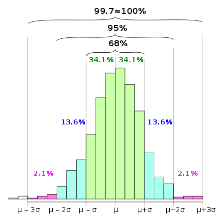

### 68-95-99.7

This is a famous rule made from normal distribution 

The above is the segemented normal distribution which is not smoothened and this is called the histogram which we obtained just after plotting the number of the value in discrete ranges when we connect the dots with a smooth line what we get is a pdf

The rule says that given a continuos rv (x) with mean=0 and stddev=1(basically says it follows normal dist), Rule says that given the above information I can say 68 percent of your observed or calculated points will lie within the first sigma and 95 percent of your observed or calculated points will lie within the second std deviation and 99.7 will lie within the third deviation

what are first,second and third std devs??

As said earlier our parameters are mean and std dev,

calculation:

1. first stddev - mean + std dev
2. second stddev - mean + 2(std dev)
3. third stddev - mean + 3(std dev) and so on
